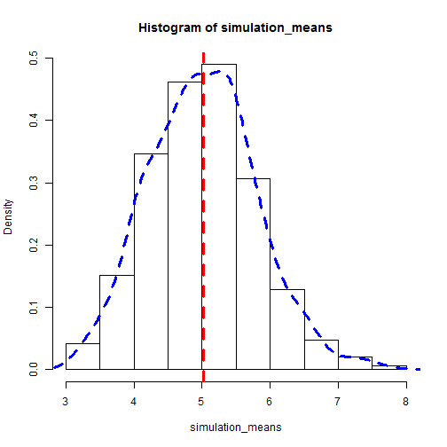

## Introduction

1. Introduing a shiny app - Interactive app to provide a simple introduction to the concept of central limit theorem and the law of large numbers

2. Inspired by Johns Hopkins Inference course on Coursera

3. Makes use of HTML page as primary interface with user - radio buttons, sliders

4. Viewable in web browser

5. LINK:
https://nssshinydev.shinyapps.io/Project/


--- .class #id 

## Screenshot
 


---
## Motivation for building app

1. Illustrates the concept to beginners by varying simulation scenarios the need to know R programming.

2. Rapid changing of simulation parameters without changing variables manually in R.

3. Uses HTML which is familiar to many people who use the internet. HTML is also accessible offline as long as a web browser is available.


---

## Underlying code
Below is an example of the code required to produce the histogram from the screen shot for one scenario. Without the sliders to provide data input user needs to change the variables manually:


```r
#User needs to change these variables manually for each simulation scenario
nosim <- 1000 # number of simulations
sample <- 40 #sample size
lambda <- 0.2 # lambda of exponential distribution

#Generate random samples and calculate means
experiment <- replicate(nosim,rexp(sample,lambda))
  simulation_means <- apply(experiment,2,mean)
  mean_of_means <- round(mean(simulation_means),3)
 
#create histogram with probablity density
  hist(simulation_means,prob=TRUE)
  par(col="red",lty=2,lwd=3)
  abline(v=mean_of_means)
  par(col="blue",lwd=3)
  lines(density(simulation_means))
```
